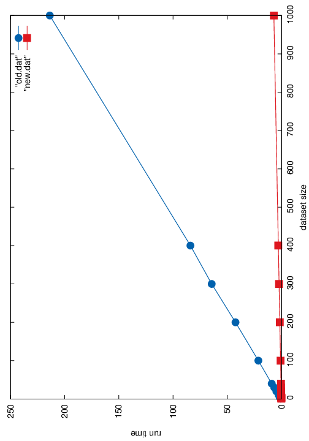
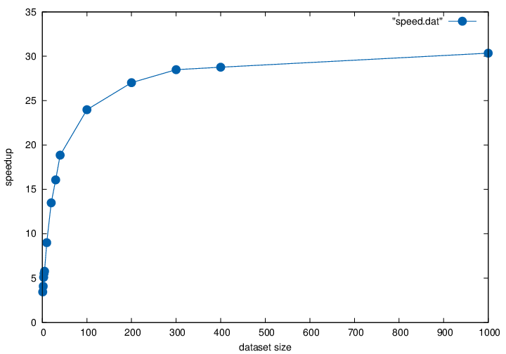

# Benchmarking test for the C library
First we make datasets, these are multiples of the `test.fa` file in the `data`
directory. The original file contains 9 records, so the largest generated
dataset will contain 9000 records.

    for j in 1 2 3 4 5 10 20 30 40 100 200 300 400 1000; do
      i=0
      while [ $i -le $j ]; do
        cat data/test.fa >> /tmp/test_$j.fa
        i=$((i + 1))
      done
    done

The tests are done with this snippet. We print the relative size of the dataset
and the amount of (user) seconds it takes for the program to run.

    for i in 1 2 3 4 5 10 20 30 40 100 200 300 400 1000; do
      echo -n "$i "
      /usr/bin/time -f "%U" tssv /tmp/test_$i.fa data/library.csv -r /dev/null
    done

Save the files in `old.dat` and `new.dat` respectively.

## Speedup estimation
To estimate the speedup, we calculate the ratio of the raw run times for both
tests. This results in a file containing the relative size of the dataset and
the ratio of run times per test.

    IFS="
    "
    for i in `paste -d ' ' old.dat new.dat`; do
      echo -n "$(echo $i | cut -f 1 -d ' ') "
      echo 3k $(echo $i | cut -f 2 -d ' ') $(echo $i | cut -f 4 -d ' ') / p | \
        dc
    done > speed.dat

## Plotting
We use `gnuplot` for visualisation:

The raw run times:

    set terminal postscript color
    set output "benchmark.eps"
    set style line 1 lc rgb '#0060ad' lt 1 lw 2 pt 7 ps 2
    set style line 2 lc rgb '#dd181f' lt 1 lw 2 pt 5 ps 2
    set xlabel "dataset size"
    set ylabel "run time"
    plot "old.dat" with linespoints ls 1, "new.dat" with linespoints ls 2

And the speedup.

    set terminal postscript color
    set output "speed.eps"
    set style line 1 lc rgb '#0060ad' lt 1 lw 2 pt 7 ps 2
    set xlabel "dataset size"
    set ylabel "speedup"
    plot "speed.dat" with linespoints ls 1

## Results
### Raw run times

Both programs behave linearly in the size of the dataset (as expected). For an
input of 9000 records, the old method took 3 minutes and 34 seconds, the new
method takes 7 seconds.

The average run time per record is 0.023741 seconds for the old method and
0.000782 seconds for the new method. The speedup is around 30.35 times.

### Speedup

We see that because of the overhead (loading libraries, reading files, etc.)
the speedup is not constant in the size of the dataset. There seems to be an
asymptote at around 31 or 32, which we think will be the average speedup for
the new implementation.
